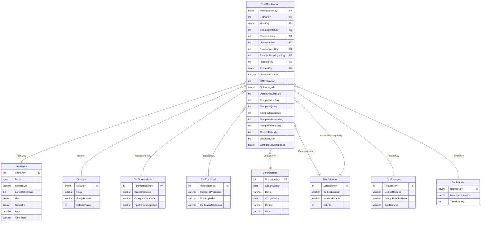

# London
# London Fire Brigade (LFB) - Business Intelligence Solution

## 1. Integrantes del Grupo
* Tania Lisset Chavez Alvitez
* Brayan Anderson Rua Pomahuacre
* Alyssa Antuanette Trujillo Cruzado
* Thiago Cesar Ormeño Freundt

## 2. Contexto

La gestión y el despliegue de los servicios públicos de respuesta inmediata representan uno de los retos operacionales más complejos en la administración urbana moderna. Dentro de este ecosistema, los cuerpos de bomberos cumplen un rol de primera línea: a diferencia de otros servicios públicos, en los que una demora solo genera inconvenientes administrativos, un retraso de pocos minutos en la atención de un incendio puede marcar el paso de una emergencia controlable a una de consecuencias irreversibles. Los ensayos de Kerber (2012) muestran que un incendio en una sala con mobiliario moderno puede alcanzar el flashover en menos de cinco minutos, cuando con mobiliario antiguo tardaba del orden de treinta. El flashover es el momento en que el calor acumulado hace que todo el material combustible de una habitación se encienda casi al mismo tiempo. Por ello, la operación diaria enfrenta una tensión constante entre la necesidad de arribar en tiempos mínimos y la disponibilidad limitada de autobombas, tripulaciones y presupuesto operativo.

Esta tensión se acentúa en las grandes ciudades, donde la demanda de auxilio es constante y los desplazamientos resultan más complejos. Londres es un caso representativo: allí el servicio lo presta la London Fire Brigade (LFB). En el Reino Unido no existen estándares nacionales de tiempo de respuesta, por lo que la LFB fija los suyos en su plan de gestión de riesgos: la primera autobomba debe llegar a cualquier punto de la ciudad en un promedio de seis minutos y la segunda en un promedio de ocho (HMICFRS, 2024). Este tiempo se mide desde que la unidad es movilizada hasta que llega al lugar del incidente (London Assembly Research Unit, 2026).

La LFB cumple esa meta en promedio, pero con un margen cada vez menor. Desde 2017, el número de incidentes atendidos ha crecido en un tercio y, desde 2020, el tiempo promedio de llegada de la primera autobomba ha aumentado cada año, aunque sigue por debajo de los seis minutos (London Assembly Research Unit, 2026). Parte de esa demanda no corresponde a emergencias reales. En 2025, las alarmas automáticas de incendio (AFA), que se activan mediante sistemas de detección instalados en los edificios, representaron cerca de un tercio de todos los incidentes atendidos. En los predios no residenciales, casi todas resultaron ser falsas alarmas: menos del 1 % correspondió a un incendio real (LFB, s.f.-a). El fenómeno no es exclusivo de la capital, pues en el conjunto de Inglaterra las falsas alarmas superan un tercio de los incidentes atendidos (MHCLG, 2025). A ello se suma la fricción vial: aunque sus demoras se redujeron respecto del año anterior, Londres siguió siendo en 2025 la ciudad más congestionada del Reino Unido (INRIX, 2025).

Cada salida injustificada implica horas de personal y de vehículo que la LFB valoriza en un costo nocional, calculado según el tiempo que cada unidad permanece en el incidente, redondeado a la hora, y una tarifa horaria estándar de la institución (LFB, s.f.-c). En el año previo a su consulta de 2023, atender falsas alarmas automáticas en predios no residenciales consumió cerca de 23,500 horas de tiempo de bomberos (LFB, 2023). Mientras una unidad permanece inmovilizada, la siguiente emergencia de su zona debe atenderse desde otra estación; de hecho, el cálculo oficial de los tiempos de arribo incluye autobombas enviadas desde otras áreas de estación (LFB, s.f.-b). En ese escenario, los tiempos de viaje aumentan y la cobertura territorial queda temporalmente vulnerable. Consciente de este costo, la LFB ya no acude entre las 7:00 y las 20:30 a las alarmas automáticas de la mayoría de edificios comerciales, salvo que una llamada confirme el fuego (LFB, s.f.-a).

En consecuencia, el problema no reside en que la LFB incumpla hoy su meta promedio, sino en que ese margen se estrecha mientras crece la demanda, y en que una cifra agregada puede ocultar diferencias entre distritos (boroughs), franjas horarias y tipos de incidente. Identificar dónde y por qué se concentra ese deterioro exige examinar el detalle de cada atención. La LFB publica en el London Datastore registros abiertos de cada incidente atendido desde 2009, con cuándo y dónde ocurrió y de qué tipo fue, actualizados mensualmente, y de cada autobomba movilizada, con su estación de origen y sus tiempos de llegada (LFB, 2026a, 2026b). Esta información permite analizar la problemática desde múltiples perspectivas cruzadas y convertirla en evidencia para optimizar los recursos y tiempos de auxilio en la ciudad.

## 3. Marco Teórico
* **Principios de Business Intelligence:** Integración y transformación de datos operacionales para la toma de decisiones estratégicas en servicios públicos de emergencia.
* **Metodología de Modelado Dimensional (Ralph Kimball):** Implementación de un Esquema en Estrella (*Star Schema*) compuesto por una tabla de hechos transaccional y dimensiones conformadas.
* **Procesos ETL:** Extracción, limpieza y carga de registros de incidentes y movilizaciones hacia un repositorio analítico.

## 4. Descripción de la Entidad y Problemática
* **Entidad:** El proyecto toma como institución de referencia a la London Fire Brigade (LFB), el servicio de bomberos y rescate de la ciudad de Londres. Está dirigida por el London Fire Commissioner y supervisada por el Alcalde de Londres. Es el servicio de bomberos más ocupado del Reino Unido y uno de los más grandes del mundo: cada año recibe alrededor de un cuarto de millón de llamadas al 999, de las cuales aproximadamente 120 000 terminan en un incidente que requiere enviar un camión.
  
* **Problemática:** En una emergencia, los primeros minutos son decisivos. Por ello, el tiempo de respuesta es el indicador central con el que se evalúa el desempeño de un servicio de bomberos. La LFB se compromete a que el primer camión llegue en un promedio de 6 minutos y el segundo en 8. En promedio cumple (5 min 34 s entre enero de 2025 y julio de 2026), pero el promedio de Londres esconde brechas: solo el 65,5 % de los primeros camiones llega en 6 minutos o menos, y distritos como Hillingdon, Havering, Bromley y Enfield superan los 6 minutos. Además, las falsas alarmas representan el 57,6 % de las movilizaciones. La información para analizar estas brechas está dividida en dos archivos separados (incidentes y movilizaciones), lo que impide saber con rapidez dónde, cuándo y por qué no se cumplen los estándares.

**Pregunta Central de Negocio**
> ¿Qué distritos (*boroughs* y *wards*) y tipos de incidente debe priorizar la London Fire Brigade para optimizar sus tiempos de arribo, reducir su exposición a las demoras en el trayecto y disminuir el costo nocional de las movilizaciones por falsas alarmas durante 2025, y se mantienen estos patrones en el primer semestre de 2026?
  
* **Objetivo:** Diseñar un datamart que integre los registros de incidentes y movilizaciones de la LFB para analizar el cumplimiento de los estándares de tiempo de respuesta y el uso de sus recursos.
Integrar y depurar los archivos de incidentes y movilizaciones mediante un proceso ETL.

  * **General:** Diseñar un datamart que integre los registros de incidentes y movilizaciones de la LFB para analizar el cumplimiento de       los estándares de tiempo de respuesta y el uso de sus recursos.
  * **Específicos:**
    1. Integrar y depurar los archivos de incidentes y movilizaciones mediante un proceso ETL.
    2. Diseñar un modelo en estrella con 8 dimensiones que permita analizar los tiempos de respuesta por zona, horario, tipo de                  incidente, estación y causa de retraso.
    3. Definir KPIs basados en los estándares de la LFB (6 minutos para el primer camión y 8 para el segundo).
    4. Identificar los distritos, horarios y causas con mayor incumplimiento para proponer mejoras.

---

## 5. Modelamiento Dimensional (8 Dimensiones)

### 5.1 Fuentes de datos

| Fuente | Archivos | Uso |
|---|---|---|
| [LFB Incident Records](https://data.london.gov.uk/dataset/london-fire-brigade-incident-records-em8xy) | `incidentes_2009_2017`, `incidentes_2018_2023`, `incidentes_2024_hasta_julio_2026` | Dimensiones del incidente (fecha, hora, tipo, propiedad, ubicación, estación del área) |
| [LFB Mobilisation Records](https://data.london.gov.uk/dataset/london-fire-brigade-mobilisation-records-24r65) | `movilizaciones_2009_2014`, `movilizaciones_2015_2020`, `movilizaciones_2021_2024`, `movilizaciones_2025_hasta_julio_2026` | Tabla de hechos y dimensiones de camión, estación de salida y retraso |

Ambas fuentes se unen por `IncidentNumber`. Los datos se publican bajo la Open Government Licence v2.0.

### 5.2 Definición

* **Proceso de negocio:** movilización de camiones de bomberos a incidentes.
* **Granularidad:** una fila por cada camión movilizado a un incidente.
* **Tabla de hechos:** `FactMovilizacion`.
* **Dimensiones (8):** `DimFecha`, `DimHora`, `DimTipoIncidente`, `DimPropiedad`, `DimUbicacion`, `DimEstacion` (dos roles: estación del área y estación de salida), `DimRecurso` y `DimRetraso`.

### 5.3 Modelo en estrella



### 5.4 Métricas y KPIs

| Tipo | Nombre | Cálculo | Meta |
|---|---|---|---|
| Métrica | Movilizaciones | `SUM(CantidadMovilizaciones)` | — |
| Métrica | Incidentes atendidos | `COUNT(DISTINCT NumeroIncidente)` | — |
| Métrica | Horas-camión | `SUM(TiempoServicioSeg) / 3600` | — |
| KPI | Tiempo promedio del 1.er camión | `AVG(TiempoLlegadaSeg)` con `OrdenLlegada = 1` | ≤ 6 min |
| KPI | Tiempo promedio del 2.º camión | `AVG(TiempoLlegadaSeg)` con `OrdenLlegada = 2` | ≤ 8 min |
| KPI | % primer camión en 10 min | `AVG(LlegaEn10Min)` con `OrdenLlegada = 1` | ≥ 90 % |
| KPI | % horas-camión en falsas alarmas | Horas-camión *False Alarm* / horas-camión totales | — |

### 5.5 Llaves primarias

| Tabla | PK | ¿Autogenerada? | Motivo |
|---|---|---|---|
| FactMovilizacion | MovilizacionKey | Sí | Llave técnica de la tabla de hechos |
| DimFecha | FechaKey (AAAAMMDD) | No | Llave estándar de Kimball; se genera con un calendario |
| DimHora | HoraKey (0–23) | No | Catálogo fijo de 24 valores |
| DimRetraso | RetrasoKey (= DelayCodeId) | No | Catálogo pequeño definido por la LFB |
| Resto de dimensiones | …Key | Sí | La fuente trae textos, no IDs estables |

### 5.6 Consideraciones del diseño

* Los datos del incidente se repiten en cada camión; para contar incidentes se usa `COUNT(DISTINCT NumeroIncidente)`.
* No se usan métricas a nivel incidente (`Notional Cost`, `PumpMinutesRounded`, `NumCalls`), porque se sumarían una vez por cada camión.
* `DateAndTimeReturned` viene vacía en todos los registros, así que el tiempo de servicio se mide hasta que el camión deja el lugar.
* El 71 % de las movilizaciones no tiene código de retraso; se asigna a "No registrado" (0).
* `DeployedFromLocation` solo tiene dos valores, por lo que se guarda como el indicador `DesdeOtraEstacion` en la tabla de hechos.
* Las coordenadas y el código postal se descartan: la LFB los oculta en viviendas (61,8 % de nulos).
* Los nulos vienen como el texto `NULL` y `PropertyType` trae espacios al final; se limpian en el ETL.

---

## 6. Diccionario de Datos

A continuación se describen las tablas que conforman el modelo dimensional y, al final, las columnas de las fuentes originales con la decisión tomada para cada una.

### 6.1 Tablas del modelo dimensional

#### FactMovilizacion
**Descripción:** tabla de hechos que almacena una fila por cada camión movilizado a un incidente, con sus tiempos de respuesta y los indicadores de cumplimiento de los estándares.

| Nombre de columna | Tipo de dato | Descripción | Origen |
|---|---|---|---|
| MovilizacionKey | BIGINT IDENTITY | Identificador único de la tabla de hechos (PK). | Autogenerada |
| FechaKey | INT | Llave foránea a DimFecha (AAAAMMDD). | DateOfCall |
| HoraKey | TINYINT | Llave foránea a DimHora. | HourOfCall |
| TipoIncidenteKey | INT | Llave foránea a DimTipoIncidente. | Incidentes |
| PropiedadKey | INT | Llave foránea a DimPropiedad. | Incidentes |
| UbicacionKey | INT | Llave foránea a DimUbicacion. | Incidentes |
| EstacionAreaKey | INT | Llave foránea a DimEstacion: estación responsable del área. | IncidentStationGround |
| EstacionDespliegueKey | INT | Llave foránea a DimEstacion: estación de donde salió el camión. | DeployedFromStation_Code |
| RecursoKey | INT | Llave foránea a DimRecurso. | Resource_Code |
| RetrasoKey | TINYINT | Llave foránea a DimRetraso. | DelayCodeId |
| NumeroIncidente | VARCHAR(20) | Código original del incidente (dimensión degenerada). | IncidentNumber |
| IdMovilizacion | INT | Código original de la movilización (dimensión degenerada). | ResourceMobilisationId |
| OrdenLlegada | TINYINT | Orden de llegada: 1 = primer camión, 2 = segundo, etc. | PumpOrder |
| DesdeOtraEstacion | BIT | 1 si el camión salió desde una estación distinta a la suya (estaba de paso); nulo si no se registró. | DeployedFromLocation |
| TiempoSalidaSeg | INT | Segundos desde la movilización hasta que el camión sale. | TurnoutTimeSeconds |
| TiempoViajeSeg | INT | Segundos de viaje hasta el lugar del incidente. | TravelTimeSeconds |
| TiempoLlegadaSeg | INT | Segundos desde la movilización hasta la llegada. | AttendanceTimeSeconds |
| TiempoEnEscenaSeg | INT | Segundos que el camión permaneció en el lugar (precisión de minuto). | DateAndTimeLeft − DateAndTimeArrived |
| TiempoServicioSeg | INT | Segundos desde la movilización hasta que el camión deja el lugar (precisión de minuto). | DateAndTimeLeft − DateAndTimeMobilised |
| CumpleEstandar | BIT | 1 si el 1.er camión llegó en ≤ 360 s o el 2.º en ≤ 480 s; nulo para el 3.º en adelante. | Calculado |
| LlegaEn10Min | BIT | 1 si el camión llegó en ≤ 600 s. | Calculado |
| CantidadMovilizaciones | TINYINT | Siempre 1; se usa para contar movilizaciones sumando. | Constante |

#### DimFecha
**Descripción:** almacena la información temporal de la llamada al 999. Permite analizar tendencias por día, mes, trimestre, año calendario y año fiscal británico.

| Nombre de columna | Tipo de dato | Descripción |
|---|---|---|
| FechaKey | INT | Identificador de la fecha en formato AAAAMMDD (PK, no autogenerada). |
| Fecha | DATE | Fecha completa de la llamada. |
| Dia | TINYINT | Día del mes. |
| NombreDia | VARCHAR(10) | Nombre del día de la semana (Lunes, Martes…). |
| EsFinDeSemana | BIT | 1 si es sábado o domingo. |
| Semana | TINYINT | Número de semana del año. |
| Mes | TINYINT | Número del mes (1–12). |
| NombreMes | VARCHAR(12) | Nombre del mes. |
| Trimestre | TINYINT | Trimestre del año (1–4). |
| Anio | SMALLINT | Año calendario. |
| AnioFiscal | VARCHAR(7) | Año fiscal británico (abril–marzo), por ejemplo 2023/24. |

#### DimHora
**Descripción:** clasifica la hora de la llamada para analizar los tiempos de respuesta según el momento del día y las horas de mayor tráfico.

| Nombre de columna | Tipo de dato | Descripción |
|---|---|---|
| HoraKey | TINYINT | Hora de la llamada, de 0 a 23 (PK, no autogenerada). |
| Hora | VARCHAR(5) | Hora en formato texto (00:00, 01:00…). |
| FranjaHoraria | VARCHAR(15) | Madrugada, Mañana, Tarde o Noche. |
| EsHoraPunta | BIT | 1 en horas de mayor tráfico (7–9 y 17–19). |

#### DimTipoIncidente
**Descripción:** describe la naturaleza del incidente atendido, desde la categoría general hasta el detalle del servicio especial.
**Jerarquía:** GrupoIncidente → CategoriaDetallada → TipoServicioEspecial.

| Nombre de columna | Tipo de dato | Descripción |
|---|---|---|
| TipoIncidenteKey | INT IDENTITY | Identificador único de la dimensión (PK). |
| GrupoIncidente | VARCHAR(20) | Categoría general (3 valores): Fire, False Alarm o Special Service. |
| CategoriaDetallada | VARCHAR(40) | Categoría detallada (12 valores): AFA, Primary Fire, Secondary Fire, False alarm - Good intent, etc. |
| TipoServicioEspecial | VARCHAR(40) | Detalle del servicio especial (20 valores): Effecting entry/exit, Flooding, Lift Release, RTC, etc. "No aplica" si no es servicio especial. |

#### DimPropiedad
**Descripción:** describe el tipo de lugar o propiedad donde ocurrió el incidente.
**Jerarquía:** CategoriaPropiedad → TipoPropiedad.

| Nombre de columna | Tipo de dato | Descripción |
|---|---|---|
| PropiedadKey | INT IDENTITY | Identificador único de la dimensión (PK). |
| CategoriaPropiedad | VARCHAR(20) | Categoría general (9 valores): Dwelling, Non Residential, Outdoor, Road Vehicle, Other Residential, Outdoor Structure, Aircraft, Rail Vehicle, Boat. |
| TipoPropiedad | VARCHAR(100) | Tipo específico (280 valores): viviendas, oficinas, vehículos, basura, etc. |
| CalificadorUbicacion | VARCHAR(50) | Ubicación del incidente respecto a la propiedad (11 valores): Correct incident location, Within same building, In street outside gazetteer location, etc. |

#### DimUbicacion
**Descripción:** almacena la ubicación geográfica del incidente dentro de Londres.
**Jerarquía:** Barrio → Distrito → Zona → Ciudad.

| Nombre de columna | Tipo de dato | Descripción |
|---|---|---|
| UbicacionKey | INT IDENTITY | Identificador único de la dimensión (PK). |
| CodigoBarrio | CHAR(9) | Código ONS del barrio (*ward*); 704 barrios. |
| Barrio | VARCHAR(60) | Nombre del barrio. |
| CodigoDistrito | CHAR(9) | Código ONS del distrito (*borough*). |
| Distrito | VARCHAR(30) | Nombre del distrito; 33 distritos (32 *boroughs* + City of London). |
| Zona | VARCHAR(15) | Inner London u Outer London. |
| Ciudad | VARCHAR(10) | London. |

#### DimEstacion
**Descripción:** catálogo de estaciones de bomberos (111 en los datos, incluidas algunas de brigadas vecinas). Es una dimensión de rol: se usa dos veces en la tabla de hechos, como estación responsable del área (**EstacionArea**) y como estación de donde salió el camión (**EstacionDespliegue**).

| Nombre de columna | Tipo de dato | Descripción |
|---|---|---|
| EstacionKey | INT IDENTITY | Identificador único de la dimensión (PK). |
| CodigoEstacion | VARCHAR(5) | Código LFB de la estación (por ejemplo, A39). |
| NombreEstacion | VARCHAR(40) | Nombre de la estación (por ejemplo, Finchley). |
| EsLFB | BIT | 1 si la estación pertenece a la LFB; 0 si es de una brigada vecina (Surrey, Essex, etc.). |

#### DimRecurso
**Descripción:** identifica el camión de bomberos (bomba) que fue movilizado; hay 142 camiones en los datos.

| Nombre de columna | Tipo de dato | Descripción |
|---|---|---|
| RecursoKey | INT IDENTITY | Identificador único de la dimensión (PK). |
| CodigoRecurso | VARCHAR(10) | Código del camión (por ejemplo, A392). |
| CodigoEstacionBase | VARCHAR(5) | Estación a la que pertenece el camión: los tres primeros caracteres del código (A392 → A39). |
| TipoRecurso | VARCHAR(20) | Tipo de recurso: Bomba (*pump*). |

#### DimRetraso
**Descripción:** catálogo de las causas de retraso que registran los bomberos. En los datos hay 10 códigos; el código 12 ("Not held up") indica que no hubo retraso. El 71 % de las movilizaciones no tiene código y se asigna al miembro 0, "No registrado".

| Nombre de columna | Tipo de dato | Descripción |
|---|---|---|
| RetrasoKey | TINYINT | Toma el valor de DelayCodeId (PK, no autogenerada). 0 = No registrado. |
| DescripcionRetraso | VARCHAR(40) | Causa: Traffic, roadworks, etc; Traffic calming measures; Address incomplete/wrong; Weather conditions; Not held up; etc. |
| TieneRetraso | BIT | 1 si hubo retraso; 0 para "Not held up" (12) y para "No registrado" (0). |

### 6.2 Columnas de las fuentes originales

Las descripciones siguen los metadatos oficiales que publica la LFB junto a cada conjunto de datos (`docs/metadatos/`); los ejemplos, tipos y porcentajes de nulos se obtuvieron de los archivos descargados. Frente a los metadatos del PDF de 2022, los archivos actuales tienen estas diferencias: `PumpHoursRoundUp` pasó a ser `PumpMinutesRounded`; se agregaron `NumCalls` (incidentes) y `BoroughName` y `WardName` (movilizaciones); y las fechas de movilización ya no traen segundos.

#### Fuente 1: LFB Incident Records
Columnas revisadas sobre `incidentes_2024_hasta_julio_2026.xlsx` (39 columnas).

| Columna | Descripción | Ejemplo real | Tipo SQL | % nulos | ¿Se usa? |
|---|---|---|---|---|---|
| IncidentNumber | Número único del incidente | 000012-01012024 | VARCHAR(20) | 0 | ✅ Dimensión degenerada |
| DateOfCall | Fecha de la llamada 999 | 2024-01-01 | DATE | 0 | ✅ DimFecha |
| CalYear | Año de la llamada | 2024 | SMALLINT | 0 | ❌ Se deriva de la fecha |
| TimeOfCall | Hora exacta de la llamada | 00:06:39 | TIME | 0 | ❌ Se usa HourOfCall |
| HourOfCall | Hora de la llamada (0–23) | 0 | TINYINT | 0 | ✅ DimHora |
| IncidentGroup | Categoría general del incidente (3 valores) | Fire | VARCHAR(20) | 0 | ✅ DimTipoIncidente |
| StopCodeDescription | Categoría detallada (12 valores) | Secondary Fire | VARCHAR(40) | 0 | ✅ DimTipoIncidente |
| SpecialServiceType | Detalle de servicios especiales (20 valores) | Lift Release | VARCHAR(40) | 59,4 | ✅ DimTipoIncidente |
| PropertyCategory | Categoría general de la propiedad (9 valores) | Outdoor | VARCHAR(20) | 0 | ✅ DimPropiedad |
| PropertyType | Tipo específico de propiedad (280 valores) | Road surface/pavement | VARCHAR(100) | 0 | ✅ DimPropiedad (aplicar TRIM) |
| AddressQualifier | Ubicación relativa a la propiedad (11 valores) | In street outside gazetteer location | VARCHAR(50) | 0 | ✅ DimPropiedad |
| Postcode_full | Código postal completo; se oculta en viviendas | N7 8HG | VARCHAR(10) | 61,8 | ❌ Oculto en viviendas (*redacted for Dwellings*) |
| Postcode_district | Distrito postal | N7 | VARCHAR(5) | 0 | ❌ No encaja en la jerarquía barrio → distrito |
| UPRN | Identificador de propiedad; se oculta en viviendas (valor 0) | 5300047882 | BIGINT | 61,8 (valor 0) | ❌ Oculto en viviendas |
| USRN | Identificador de calle | 21606449 | BIGINT | 0 | ❌ Detalle operacional |
| IncGeo_BoroughCode | Código del distrito (*borough*) | E09000019 | CHAR(9) | 0 | ✅ DimUbicacion |
| IncGeo_BoroughName | Nombre del distrito (mayúsculas) | ISLINGTON | VARCHAR(30) | 0 | ❌ Duplicado |
| ProperCase | Nombre del distrito (formato título) | Islington | VARCHAR(30) | 0 | ✅ DimUbicacion |
| IncGeo_WardCode | Código del barrio (*ward*) | E05013708 | CHAR(9) | 0,1 | ✅ DimUbicacion |
| IncGeo_WardName | Nombre del barrio | LAYCOCK | VARCHAR(60) | 0,1 | ❌ Se usa la versión nueva |
| IncGeo_WardNameNew | Nombre actualizado del barrio | LAYCOCK | VARCHAR(60) | 0,1 | ✅ DimUbicacion |
| Easting_m / Northing_m | Coordenadas británicas exactas; se ocultan en viviendas | 531073 / 185305 | INT | 61,8 | ❌ Oculto en viviendas |
| Easting_rounded / Northing_rounded | Coordenadas redondeadas a 50 m | 531050 / 185350 | INT | 0 | ❌ No aportan al análisis |
| Latitude / Longitude | Coordenadas geográficas; se ocultan en viviendas | 51.5514 / -0.1109 | DECIMAL(9,6) | 61,8 | ❌ Oculto en viviendas |
| FRS | Servicio de bomberos | London | VARCHAR(10) | 0 | ❌ Valor constante |
| IncidentStationGround | Estación responsable del área (102 valores) | Holloway | VARCHAR(40) | 0 | ✅ DimEstacion (rol: área) |
| FirstPumpArriving_AttendanceTime | Tiempo de llegada del 1.er camión (s) | 208 | INT | 5,2 | ❌ Se recalcula desde movilizaciones |
| FirstPumpArriving_DeployedFromStation | Estación del 1.er camión | Holloway | VARCHAR(40) | 5,2 | ❌ Está en movilizaciones |
| SecondPumpArriving_AttendanceTime | Tiempo de llegada del 2.º camión (s) | — | INT | 63,3 | ❌ Se recalcula desde movilizaciones |
| SecondPumpArriving_DeployedFromStation | Estación del 2.º camión | — | VARCHAR(40) | 63,3 | ❌ Está en movilizaciones |
| NumStationsWithPumpsAttending | N.º de estaciones que enviaron camión | 1 | TINYINT | 1,1 | ❌ Se obtiene contando filas |
| NumPumpsAttending | N.º de camiones que asistieron | 1 | TINYINT | 1,1 | ❌ Se obtiene contando filas |
| PumpCount | N.º de camiones movilizados | 1 | SMALLINT | 0 | ❌ Se obtiene contando filas |
| PumpMinutesRounded | Minutos-camión en el incidente; si es menos de una hora se redondea a 60 | 60 | INT | 0 | ❌ Nivel incidente; se calcula desde la tabla de hechos |
| Notional Cost (£) | Costo teórico del uso de camiones | 388 | INT | 0 | ❌ Nivel incidente (ver 4.6) |
| NumCalls | N.º de llamadas 999 recibidas por el incidente | 1 | SMALLINT | 0 | ❌ Nivel incidente; se sumaría una vez por camión |

#### Fuente 2: LFB Mobilisation Records
Columnas revisadas sobre `movilizaciones_2025_hasta_julio_2026.csv` (24 columnas). Los nulos vienen escritos como el texto `NULL`.

| Columna | Descripción | Ejemplo real | Tipo SQL | % nulos | ¿Se usa? |
|---|---|---|---|---|---|
| IncidentNumber | Número del incidente (llave de unión) | 000004-01012025 | VARCHAR(20) | 0 | ✅ Unión con incidentes |
| CalYear | Año de la llamada | 2025 | SMALLINT | 0 | ❌ Se deriva de la fecha |
| BoroughName | Distrito del incidente (columna nueva, no figura en los metadatos oficiales) | HAMMERSMITH AND FULHAM | VARCHAR(30) | 0,4 | ❌ Se toma del incidente, que trae el código |
| WardName | Barrio del incidente (columna nueva, no figura en los metadatos oficiales) | FULHAM REACH | VARCHAR(60) | 0,5 | ❌ Se toma del incidente, que trae el código |
| HourOfCall | Hora de la llamada | 0 | TINYINT | 0 | ❌ Se toma del incidente |
| ResourceMobilisationId | ID único de la movilización | 6862256 | INT | 0 | ✅ Dimensión degenerada |
| Resource_Code | Código del camión (142 valores) | H331 | VARCHAR(10) | 0 | ✅ DimRecurso |
| PerformanceReporting | Orden de llegada para el reporte: 1, 2 o Not Used | 1 | VARCHAR(10) | 0 | ❌ Equivale a PumpOrder; se usa para validar |
| DateAndTimeMobilised | Fecha y hora de movilización (sin segundos) | 01/01/2025 00:02 | DATETIME | 0 | ✅ Cálculo de TiempoServicioSeg |
| DateAndTimeMobile | Fecha y hora de salida (sin segundos) | 01/01/2025 00:07 | DATETIME | 0,5 | ❌ Se usa TurnoutTimeSeconds |
| DateAndTimeArrived | Fecha y hora de llegada (sin segundos) | 01/01/2025 00:13 | DATETIME | 0 | ✅ Cálculo de TiempoEnEscenaSeg |
| TurnoutTimeSeconds | Tiempo de salida de la estación (s) | 310 | INT | 0,5 | ✅ Métrica |
| TravelTimeSeconds | Tiempo de viaje (s) | 311 | INT | 0,5 | ✅ Métrica |
| AttendanceTimeSeconds | Tiempo total de llegada (s) = salida + viaje; máximo 1200 | 621 | INT | 0 | ✅ Métrica |
| DateAndTimeLeft | Fecha y hora en que dejó el incidente (sin segundos) | 01/01/2025 00:23 | DATETIME | 0,1 | ✅ Cálculo de tiempos |
| DateAndTimeReturned | Fecha y hora de retorno a la estación | — | DATETIME | 100 | ❌ Siempre vacía |
| DeployedFromStation_Code | Código de la estación de salida (111 valores) | H33 | VARCHAR(5) | 0 | ✅ DimEstacion |
| DeployedFromStation_Name | Nombre de la estación de salida | Wandsworth | VARCHAR(40) | 0 | ✅ DimEstacion (rol: despliegue) |
| DeployedFromLocation | Desde dónde salió: Home Station u Other Station | Home Station | VARCHAR(15) | 0,2 | ✅ DesdeOtraEstacion (tabla de hechos) |
| PumpOrder | Orden de llegada del camión (1 a 10) | 2 | TINYINT | 0 | ✅ OrdenLlegada |
| PlusCode_Code | Código del tipo de movilización | Initial | VARCHAR(10) | 0 | ❌ Valor constante |
| PlusCode_Description | Descripción del tipo de movilización | Initial Mobilisation | VARCHAR(30) | 0 | ❌ Valor constante |
| DelayCodeId | ID de la causa de retraso (10 valores) | 12 | TINYINT | 71,4 | ✅ DimRetraso |
| DelayCode_Description | Descripción del retraso | Not held up | VARCHAR(40) | 71,4 | ✅ DimRetraso |

---

## 7. Estructura del Repositorio

```
LFB-BI/
├── README.md                              ← Marco teórico, entidad, problemática, modelo y diccionario
├── docs/
│   └── metadatos/
│       ├── diccionario_incidentes.xlsx    ← Metadatos oficiales de la LFB
│       └── diccionario_movilizaciones.xlsx
├── data/
│   ├── FUENTES.md                         ← Fuentes, licencia y fecha de descarga
│   ├── manifest_descargas.json            ← Enlaces y hashes de los archivos
│   └── sample/                            ← Muestra de 1 000 filas de cada archivo
└── modelo/
    └── modelo_estrella.png                ← Diagrama del modelo dimensional
```

---

## 8. Referencias

* HMICFRS. (2024). *London Fire Brigade: Fire and rescue service inspection 2023–2025*. https://hmicfrs.justiceinspectorates.gov.uk/frs-assessments/london-2023-2025/
* Kimball, R., & Ross, M. (2013). *The data warehouse toolkit: The definitive guide to dimensional modeling* (3.ª ed.). Wiley.
* London Fire Brigade. (2022). *Freedom of Information request 6531.1: Response*. https://www.london-fire.gov.uk/media/6611/65311_response.pdf
* London Fire Brigade. (2026). *London Fire Brigade incident records* [Conjunto de datos]. London Datastore, Greater London Authority. Recuperado el 24 de septiembre de 2026 de https://data.london.gov.uk/dataset/london-fire-brigade-incident-records-em8xy
* London Fire Brigade. (2026). *London Fire Brigade mobilisation records* [Conjunto de datos]. London Datastore, Greater London Authority. Recuperado el 24 de septiembre de 2026 de https://data.london.gov.uk/dataset/london-fire-brigade-mobilisation-records-24r65
* Microsoft. (s.f.). *Documentación de SQL Server Integration Services*. Microsoft Learn. https://learn.microsoft.com/es-es/sql/integration-services/
* The National Archives. (s.f.). *Open Government Licence v2.0*. https://www.nationalarchives.gov.uk/doc/open-government-licence/version/2/