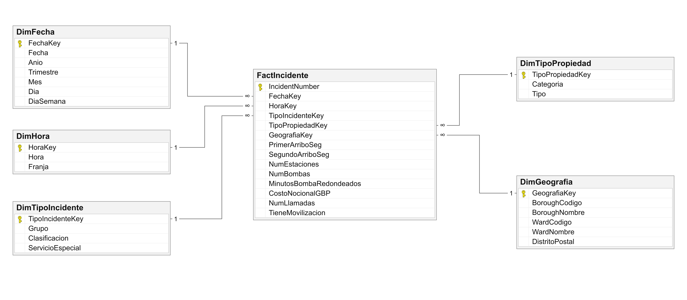
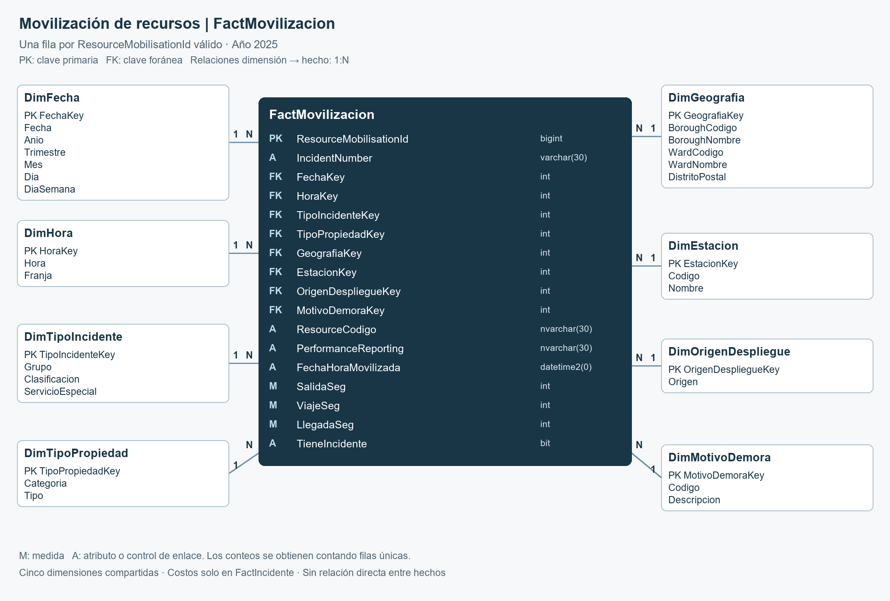

# Tiempos de respuesta y uso de recursos en la atención de incidentes de London Fire Brigade

**Integrantes:**

- Tania Lisset Chavez Alvitez
- Brayan Anderson Rua Pomahuacre
- Alyssa Antuanette Trujillo Cruzado
- Thiago Cesar Ormeño Freundt

## 1. Introducción

La gestión de los servicios públicos de respuesta inmediata exige atender las necesidades de la población y organizar los recursos disponibles para hacerlo. En los servicios de bomberos, esta tarea implica responder a situaciones de distinta naturaleza y gravedad, en las que deben considerarse tanto la rapidez de la atención como los recursos necesarios para intervenir.

En el Reino Unido, la actividad de estos servicios abarca distintos tipos de incidentes, no solo incendios. Las estadísticas oficiales de Inglaterra muestran que las falsas alarmas representaron más de un tercio de los incidentes atendidos en el año terminado en marzo de 2025 (MHCLG, 2025). Este contexto evidencia la importancia de examinar la composición de la demanda, además de la respuesta a los incendios.

En Londres, esta función la cumple la London Fire Brigade (LFB), que atiende incendios, servicios especiales y falsas alarmas mediante un proceso que comienza con la llamada de emergencia y continúa con la movilización de las unidades, su desplazamiento hasta el lugar, la intervención y el retorno a la estación. Este proceso constituye el objeto de estudio del proyecto y puede examinarse desde dos perspectivas complementarias: la oportunidad de la respuesta, es decir, el tiempo que tardan los recursos en llegar, y los recursos que requiere cada incidente. Ambas adquieren significado al considerar el tipo de incidente, la zona, el horario y el tipo de inmueble. Aunque el proceso completo incluye el retorno de las unidades, el análisis se concentrará en los tiempos desde la movilización hasta la llegada y en los recursos registrados para la atención.

La oportunidad de la respuesta es especialmente importante cuando existe riesgo para las personas y los bienes. Los ensayos de Kerber (2012) muestran que, en condiciones experimentales, una sala con mobiliario moderno puede alcanzar el flashover (la transición rápida hacia un incendio generalizado en el ambiente) en menos de cinco minutos. La LFB fija como meta que la primera autobomba llegue en un promedio de seis minutos y la segunda en un promedio de ocho, contados desde la movilización del recurso. Se trata de promedios para todo Londres, no de un plazo garantizado en cada atención (Greater London Authority, 2025; LFB, 2024).

Aunque el promedio de primera llegada se mantiene dentro de la meta de seis minutos, su margen se ha reducido. Entre 2017 y 2025, los incidentes atendidos aumentaron cerca de un tercio y, tras una leve reducción en 2020, el tiempo promedio de primera llegada aumentó cada año hasta alcanzar 329 segundos en 2025 (London Assembly Research Unit, 2026). Como contexto del desplazamiento, Londres fue en 2025 la ciudad más congestionada del Reino Unido (INRIX, 2025); este dato general no mide directamente las demoras de las autobombas. Por ello, conviene examinar los tiempos y los motivos de demora que la propia LFB registra en cada movilización.

La segunda perspectiva examina los recursos empleados. Un mismo incidente puede requerir varias movilizaciones, y el despliegue depende de sus características: un incendio de gran magnitud exige más unidades que una intervención menor. La LFB valoriza este esfuerzo en un costo nocional, calculado según el tiempo de los vehículos participantes y una tarifa estándar (LFB, 2022). Este valor describe el costo estimado de la atención y no equivale a un ahorro que pueda recuperarse automáticamente.

Dentro de esta demanda, las falsas alarmas merecen atención específica. Son avisos atendidos como posibles incendios en los que se comprueba que no existía ni había existido el incendio reportado (MHCLG, 2025). Aun así, consumen movilizaciones y tiempo de bomberos: en el año previo a su consulta de 2023, las alarmas automáticas en inmuebles no residenciales ocuparon cerca de 23.500 horas (LFB, 2023). En 2025, las alarmas automáticas representaron alrededor del 34 % de los incidentes atendidos, y menos del 1 % de las procedentes de inmuebles no residenciales terminó registrado como incendio (LFB, s.f.-b). Las falsas alarmas automáticas son una parte del conjunto de falsas alarmas; una activación automática no se clasifica necesariamente como falsa alarma. Por eso, conviene identificar en qué zonas y tipos de inmueble se concentran, como base para investigar posteriormente qué las provoca y, según lo que se encuentre, orientar posibles acciones preventivas. Como referencia, la propia LFB ya recomienda a los responsables de los edificios contar con sistemas adecuados a su uso, mantenerlos y aplicar medidas para filtrar falsas alarmas (LFB, s.f.-a).

En consecuencia, el proyecto estudia la atención de incidentes de la LFB durante 2025 desde sus tiempos de respuesta y los recursos asociados. La comparación por territorio y tipo de incidente permitirá identificar qué zonas y atenciones merecen una revisión operativa y dónde conviene investigar las causas de las falsas alarmas. Para ello, la LFB publica en el London Datastore registros abiertos de cada incidente y de cada autobomba movilizada, con información de tiempo, lugar, tipo de atención y recursos, que permiten comparar las atenciones por zona y tipo de incidente (LFB, 2026a, 2026b).

## 2. Planteamiento de la problemática

### 2.1. Situación problemática

La London Fire Brigade responde a una demanda compuesta por incendios, servicios especiales y falsas alarmas, distribuida entre los distintos boroughs de Londres. Cada atención presenta características que influyen en la respuesta requerida y en los recursos utilizados. Por ello, evaluar el servicio exige considerar conjuntamente qué tipo de incidente se atiende, cuánto tardan los recursos en llegar y qué despliegue queda asociado a esa atención.

El problema de gestión consiste en determinar qué zonas y tipos de atención conviene revisar primero. Una meta promedio para todo Londres no describe las diferencias entre territorios, horarios y clases de incidente, ni muestra qué movilizaciones, minutos de autobomba y costo nocional corresponden a cada grupo de atenciones. El proyecto analizará conjuntamente estas diferencias para apoyar la identificación de zonas y tipos de atención que requieren una revisión prioritaria.

En la respuesta operativa, el análisis examinará los tiempos de salida, viaje y llegada, los motivos de demora reportados, como el tráfico o las obras viales, y la estación desde la que salió cada recurso. En los recursos, examinará las movilizaciones, las autobombas asistentes, los minutos de autobomba publicados con redondeo y el costo nocional de esas mismas atenciones. Para que las diferencias sean interpretables, se compararán incidentes de características semejantes, ya que un mayor tiempo o costo en un incendio complejo puede responder a las exigencias de la emergencia.

Dentro de esta comparación, las falsas alarmas constituyen un tipo de atención específico. Identificar en qué zonas y tipos de inmueble generan más atenciones y movilizaciones permitirá orientar la investigación de sus posibles causas y, según los resultados, evaluar acciones preventivas. Así, el análisis apoyará dos decisiones dentro del mismo proceso: dónde examinar dificultades de respuesta y dónde investigar concentraciones de falsas alarmas.

### 2.2. Pregunta central de negocio

¿Qué zonas y tipos de atención debería priorizar la London Fire Brigade para revisar su respuesta operativa y orientar acciones preventivas, considerando los tiempos de llegada, las demoras reportadas y los recursos utilizados durante 2025?

### 2.3. Objetivos

**Objetivo general:** analizar la atención de incidentes de LFB durante 2025, considerando los tiempos de llegada, las demoras reportadas y los recursos utilizados, para fundamentar qué zonas y tipos de atención deberían priorizarse para revisión operativa y orientación de acciones preventivas.

**Objetivos específicos:**

1. Caracterizar las atenciones por zona, tipo de incidente, horario y tipo de inmueble.

2. Comparar los tiempos de respuesta y las demoras reportadas entre atenciones de características semejantes.

3. Examinar las movilizaciones, las autobombas asistentes, los minutos publicados con redondeo y el costo nocional asociados a esas atenciones.

4. Identificar concentraciones de falsas alarmas por zona y tipo de inmueble, distinguiendo sus categorías, para orientar la investigación de sus posibles causas.

5. Integrar esas comparaciones para sustentar la selección de zonas y tipos de atención que requieren revisión.

### 2.4. Alcance del estudio

| Aspecto | Delimitación |
|---|---|
| Institución | London Fire Brigade. |
| Periodo | Del 1 de enero al 31 de diciembre de 2025, mediante CalYear=2025 en ambas fuentes. |
| Proceso | Atención operativa de incidentes; tiempos desde movilización hasta llegada y recursos asociados a la intervención. |
| Tipos de atención | Incendios, falsas alarmas y servicios especiales. |
| Territorio | Borough como nivel principal; ward y distrito postal para detalle cuando corresponda. |
| Contexto | Hora de llamada y categoría y tipo de propiedad. |
| Nivel de detalle | Un incidente y una movilización, conservados en hechos distintos. |
| Decisión | Dónde concentrar la revisión operativa y dónde investigar posibles causas de falsas alarmas. |

## 3. Descripción de la institución

### 3.1. Institución y finalidad

London Fire Brigade (LFB) es el servicio de bomberos y rescate de Londres. Combina la respuesta a incidentes con actividades de prevención y protección de la comunidad. Su plan 2023–2029 plantea reducir y responder al riesgo en Londres. [Plan institucional de LFB](https://www.london-fire.gov.uk/about-us/your-london-fire-brigade-our-plan-for-2023-29/).

### 3.2. Proceso de atención

| Etapa del proceso general | Relación con el proyecto |
|---|---|
| Recepción del aviso | Fecha, hora, lugar y clasificación publicada permiten describir la demanda. |
| Movilización de unidades | Se identifica cada recurso movilizado y la estación y el contexto de salida publicados. |
| Salida, desplazamiento y llegada | Se estudian los tiempos en segundos y los motivos de demora reportados. |
| Intervención | Se describen las autobombas asistentes, los minutos publicados con redondeo y el costo nocional del incidente. |
| Retorno de unidades | Forma parte del proceso general, pero queda fuera del análisis de duración y disponibilidad por insuficiencia del campo de retorno. |

### 3.3. Usuarios previstos

El análisis está orientado a las áreas de operaciones, planificación y prevención de LFB.

| Usuario propuesto | Decisión apoyada |
|---|---|
| Operaciones y planificación | Seleccionar zonas y tipos de atención en los que conviene examinar tiempos de llegada y demoras reportadas. |
| Prevención | Identificar concentraciones de falsas alarmas por zona y tipo de inmueble para investigar sus posibles causas. |

### 3.4. Contexto de respuesta a alarmas automáticas

Desde el 29 de octubre de 2024, LFB aplica una política de respuesta diferenciada a determinadas alarmas automáticas en edificios comerciales: entre las 07:00 y las 20:30, hora de Londres, requiere confirmación de incendio, salvo edificios exentos. Entre las excepciones figuran viviendas, hospitales, hoteles y escuelas. Continúa atendiendo incendios reportados a cualquier hora. [Política](https://www.london-fire.gov.uk/safety/the-workplace/automatic-fire-alarms/afa-policy/) y [preguntas oficiales](https://www.london-fire.gov.uk/safety/the-workplace/automatic-fire-alarms/afa-policy/afa-faqs/).

Esta política debe considerarse al comparar las alarmas automáticas atendidas en 2025 por horario y tipo de inmueble. Los registros corresponden a incidentes atendidos; no incluyen los avisos que no generaron movilización. Las agrupaciones por hora del modelo no distinguen el límite exacto de las 20:30.

### 3.5. Fuentes disponibles

Se utilizarán los registros abiertos oficiales de [incidentes](https://data.london.gov.uk/dataset/london-fire-brigade-incident-records-em8xy) y [movilizaciones](https://data.london.gov.uk/dataset/london-fire-brigade-mobilisation-records-24r65), publicados por LFB en London Datastore. Son datos operativos reales. Se conserva la descarga completa del 24 de septiembre de 2026 y se define como periodo de análisis el año calendario 2025, disponible completo en ambas fuentes recientes.

La fuente de incidentes describe cada atención y su contexto; la de movilizaciones describe los recursos desplegados. IncidentNumber permite relacionarlas durante la preparación. El estudio utiliza únicamente los registros de 2025.

## 4. Marco teórico

### 4.1. Business Intelligence como apoyo a la gestión

Business Intelligence reúne y organiza datos para apoyar la toma de decisiones. En este proyecto se aplica al análisis de los tiempos de respuesta y los recursos utilizados por LFB, con comparaciones por zona y tipo de incidente.

El diseño dimensional sigue cuatro pasos: seleccionar el proceso, definir el grano, identificar las dimensiones y establecer las medidas ([Kimball Group, proceso de diseño](https://www.kimballgroup.com/data-warehouse-business-intelligence-resources/kimball-techniques/dimensional-modeling-techniques/four-4-step-design-process/)).

### 4.2. Proceso, hechos y nivel de detalle

El proceso estudiado es la atención operativa de incidentes, observada mediante los registros de incidentes y de movilizaciones. Un **hecho** representa un evento medible de ese proceso. El **nivel de detalle o grano** establece qué significa una fila. Aquí existen dos: el incidente atendido y la movilización de un recurso hacia ese incidente. Un incidente puede requerir varios recursos; por eso no deben contarse como si fueran lo mismo.

Se propone conservar ambos niveles en tablas distintas. El incidente permite estudiar la demanda y su clasificación final; la movilización permite describir los recursos desplegados y el contexto de su desplazamiento. Las falsas alarmas se analizan como una categoría del incidente, no como un proceso con un grano diferente. Las comparaciones que combinan ambos hechos utilizarán el mismo conjunto de incidentes enlazados, identificado mediante controles de cobertura. El costo nocional del incidente permanece una sola vez, aunque hayan participado varios recursos. Cada grano requiere su propia tabla de hechos; las medidas deben corresponder al evento representado por la fila ([Kimball Group, grano](https://www.kimballgroup.com/data-warehouse-business-intelligence-resources/kimball-techniques/dimensional-modeling-techniques/grain/)).

### 4.3. Dimensiones y modelo multidimensional

Las dimensiones describen un hecho desde distintas perspectivas: cuándo ocurrió, dónde, qué tipo de incidente fue y qué clase de inmueble estuvo involucrada. En el despliegue se añaden estación, origen del recurso y motivo de demora reportado. Estas perspectivas permiten comparar segmentos de gestión sin perder el significado de cada evento.

El modelo estrella relaciona una tabla de hechos con dimensiones descriptivas. Al compartir dimensiones entre dos hechos se forma una constelación de estrellas. Este diseño se adapta al proceso: las dimensiones comunes relacionan la demanda con el despliegue, mientras las propias de movilización describen su ejecución. La propuesta incorpora ocho dimensiones. Fecha, hora, tipo de incidente, tipo de propiedad y geografía serán conformadas: tendrán el mismo significado y las mismas claves en ambos hechos. Esto permite agregar cada hecho por separado y comparar los resultados en los mismos grupos ([Kimball Group, dimensiones conformadas](https://www.kimballgroup.com/data-warehouse-business-intelligence-resources/kimball-techniques/dimensional-modeling-techniques/conformed-dimension/)).

### 4.4. Datamart y análisis multidimensional

Un datamart organiza información de un ámbito de la institución. El alcance aquí es la atención de incidentes durante 2025, con dos perspectivas relacionadas: tiempos de respuesta y recursos utilizados. Los incendios, falsas alarmas y servicios especiales se distinguen para comparar atenciones de características semejantes.

OLTP se orienta al registro de transacciones y OLAP a su análisis desde distintas perspectivas. En el modelo propuesto será posible examinar un año por meses, un borough por wards y una categoría de propiedad por tipos específicos. Estos niveles forman las jerarquías de análisis.

### 4.5. Integración y significado de los datos

El proceso ETL —extracción, transformación y carga— prepara los datos para el análisis. En este caso requiere relacionar incidentes y movilizaciones, uniformizar formatos, revisar duplicados y distinguir los valores ausentes de los valores registrados.

### 4.6. Conceptos operativos

| Concepto | Significado en el proyecto |
|---|---|
| Atención de incidente | Evento atendido y clasificado por LFB; puede generar varias movilizaciones. |
| Movilización | Despliegue individual de un recurso hacia un incidente. |
| Tiempo de llegada | Intervalo desde la movilización hasta la llegada del recurso; no incluye por sí solo todo el tiempo desde la llamada. |
| Primer arribo | Llegada de la primera autobomba al incidente; se distingue del tiempo de cada recurso que participa. |
| Demora reportada | Motivo registrado para contextualizar la movilización; no expresa cuántos segundos se perdieron exclusivamente por ese motivo. |
| Falsa alarma | Clasificación final de un aviso atendido como posible incendio; se identifica por IncidentGroup, sin inferirla a partir del costo o el tiempo. |
| Costo nocional | Valoración estimada del tiempo de autobombas según una tarifa estándar; no corresponde a una pérdida presupuestaria demostrada. |
| Priorización | Selección fundamentada de zonas y tipos de atención que conviene revisar; requiere comparar atenciones de características semejantes. |

Las definiciones de tiempos y costo se apoyan en los metadatos y en las aclaraciones de LFB de [2024](https://www.london-fire.gov.uk/media/8863/foia84201-response-times-of-fire-brigades-and-data-collation-response.pdf) y [2022](https://www.london-fire.gov.uk/media/6796/foi-response-66361.pdf). La clasificación de falsas alarmas se interpreta con las [definiciones oficiales de Inglaterra](https://www.gov.uk/government/statistics/fire-and-rescue-incident-statistics-year-ending-march-2025/fire-and-rescue-incident-statistics-year-ending-march-2025).

## 5. Diccionario de datos

La fuente de incidentes contiene 39 campos y la de movilizaciones, 24. Los diccionarios conservan los nombres originales y describen su uso en el modelo.

| Documento | Contenido |
|---|---|
| [Diccionario de fuentes](docs/04_Diccionario_datos/Diccionario_fuentes.md) | Los 63 campos: significado, unidad, uso en el modelo o conservación como respaldo. |
| [Diccionario de fuentes en CSV](docs/04_Diccionario_datos/Diccionario_fuentes.csv) | Versión tabular con las definiciones y notas originales del proveedor. |
| [Diccionario del modelo](docs/04_Diccionario_datos/Diccionario_modelo.md) | Todos los campos de las ocho dimensiones y los dos hechos: tipo de dato, rol, definición y transformación. |

### 5.1. Definiciones de los campos principales

- FirstPumpArriving_AttendanceTime corresponde a la primera autobomba que llegó al incidente. AttendanceTimeSeconds corresponde a una movilización. No son observaciones intercambiables.

- TurnoutTimeSeconds describe la salida desde la movilización; TravelTimeSeconds, el viaje; AttendanceTimeSeconds, el intervalo hasta la llegada. Se usan los segundos publicados y no se reconstruyen a partir de marcas redondeadas a minutos.

- False Alarm es un valor de IncidentGroup. StopCodeDescription permite distinguir categorías como AFA, Good intent o Malicious; no contiene necesariamente la causa técnica de activación.

- DelayCode_Description describe un motivo de demora de la movilización. No indica por qué se activó una alarma ni cuantifica por sí solo los segundos perdidos por tráfico.

- PumpMinutesRounded conserva el redondeo del proveedor y no equivale a duración exacta del incidente ni a horas-persona.

- Notional Cost (£) es una estimación en libras y se mantiene a nivel incidente. Unirla con varias movilizaciones no autoriza a sumarla repetidamente.

Los valores ausentes se distinguen de cero y de categorías explícitas como Not held up. PumpCount se conserva en la fuente y queda fuera de las medidas por falta de definición suficiente. PumpOrder no se usa para inferir el primer arribo porque su diccionario solo lo describe como “Pump order”.

## 6. Modelo multidimensional

### 6.1. Tablas de hechos

El modelo tiene dos tablas de hechos: una registra cada incidente y la otra, cada movilización. Un incidente puede requerir varias unidades, por lo que sus recursos y costos deben distinguirse de los tiempos de cada unidad movilizada.

| Tabla de hechos | Qué representa una fila | Qué permite analizar |
|---|---|---|
| FactIncidente | Un incidente publicado con CalYear=2025, identificado por IncidentNumber. | Demanda atendida, primera y segunda llegada publicadas, autobombas, estaciones participantes, minutos redondeados, llamadas y costo nocional de la atención. |
| FactMovilizacion | Una movilización válida de un recurso con CalYear=2025, identificada por ResourceMobilisationId. | Tiempo de salida, viaje y llegada de cada unidad, estación de despliegue, contexto de salida y motivo de demora reportado. |

Las falsas alarmas se identifican mediante DimTipoIncidente.Grupo=False Alarm, al mismo nivel de detalle que los incendios y servicios especiales. El costo nocional se mantiene solo en FactIncidente; repetirlo en cada movilización multiplicaría el costo del incidente.

IncidentNumber relaciona las fuentes durante la preparación y conserva la trazabilidad. En el modelo analítico los hechos se filtran por dimensiones compartidas y sus resultados se agregan por separado. Este diseño respeta el [grano de cada hecho](https://www.kimballgroup.com/data-warehouse-business-intelligence-resources/kimball-techniques/dimensional-modeling-techniques/grain/) y evita [uniones entre hechos que multipliquen registros](https://www.kimballgroup.com/data-warehouse-business-intelligence-resources/kimball-techniques/dimensional-modeling-techniques/multipass-sql/).

### 6.2. Dimensiones

| Dimensión | Atributos principales | Utilidad para el problema | Hechos |
|---|---|---|---|
| DimFecha | Año, trimestre, mes, día, día de semana | Ubicar periodos de concentración de la demanda | Ambos |
| DimHora | Hora y franja | Distinguir el contexto horario de las atenciones | Ambos |
| DimTipoIncidente | Grupo, clasificación y servicio especial | Distinguir incendios, falsas alarmas y servicios especiales antes de comparar su atención | Ambos |
| DimTipoPropiedad | Categoría y tipo | Contextualizar atenciones e identificar concentraciones de falsas alarmas por propiedad | Ambos |
| DimGeografia | Borough, ward y distrito postal | Delimitar segmentos territoriales | Ambos |
| DimEstacion | Código y nombre | Reconocer estaciones que participan en el despliegue | Movilización |
| DimOrigenDespliegue | Home Station, Other Station, desconocido | Distinguir el contexto de salida del recurso | Movilización |
| DimMotivoDemora | Código y descripción | Contextualizar el desplazamiento; no explicar la activación de la alarma | Movilización |

El origen del despliegue conserva las categorías Home Station y Other Station, distintas del código y nombre de estación; no identifica la disponibilidad de la estación más cercana. El motivo de demora no se interpreta como causa de falsa alarma.

### 6.3. Relaciones y claves

Cada dimensión tiene una clave primaria (PK), y el hecho correspondiente almacena una clave foránea (FK). La cardinalidad es **1:N**: una combinación dimensional puede aparecer en muchos hechos. FactIncidente tiene cinco relaciones dimensionales; FactMovilizacion tiene ocho. Las primeras cinco son conformadas: comparten la misma definición en ambos hechos.

Las claves de fecha y hora se generan de forma determinista. Las demás dimensiones usan claves sustitutas que identifican sus combinaciones descriptivas. El miembro 0 identifica valores desconocidos. Una movilización sin incidente enlazado conserva su registro y sus dimensiones propias, pero no se le atribuye una falsa alarma ni un territorio a partir de suposiciones.

### 6.4. Medidas

En FactIncidente se conservan la cantidad de bombas asistentes, estaciones participantes, llamadas, minutos de bomba redondeados, costo nocional y tiempos publicados de primer y segundo arribo. La cantidad de incidentes se obtiene contando sus filas; TieneMovilizacion identifica si existe al menos una movilización válida enlazada. En FactMovilizacion se conservan los tiempos de salida, viaje y llegada, y la cantidad de movilizaciones se obtiene contando filas válidas.

El análisis describe diferencias en tiempos y recursos; no demuestra que una falsa alarma haya causado retrasos en otra emergencia.

El costo y las llamadas se agregan únicamente desde FactIncidente. Sumar NumBombas representa participaciones en incidentes, no vehículos únicos. Los tiempos de recursos no equivalen a duración total del incidente. Los filtros de estación, origen y demora corresponden a movilizaciones; no deben asignar artificialmente costos de incidentes a estaciones.

### 6.5. Jerarquías

- Fecha: año → trimestre → mes → día. Día de semana es un atributo independiente.

- Propiedad: categoría → tipo.

- Geografía: borough → ward, validando correspondencia. Distrito postal es un filtro alternativo, no un nivel necesariamente contenido en ward.

- Incidente: grupo → clasificación. Servicio especial solo aporta detalle cuando corresponde.

- Hora: franja → hora. Las franjas son agrupaciones académicas y no turnos oficiales de LFB.

### 6.6. Preparación de los datos

Las copias idénticas de movilizaciones se deduplicarán y los identificadores con versiones contradictorias se revisarán antes de cargar. Los valores desconocidos permanecerán distinguibles de las categorías reales. Las dimensiones comunes de la movilización procederán del incidente enlazado. No se duplicarán medidas del incidente al integrar recursos.

### 6.7. Agregación y comparación entre hechos

| Medida | Agregación e interpretación |
|---|---|
| Incidentes | Conteo de filas únicas de FactIncidente. |
| Movilizaciones | Conteo de filas válidas de FactMovilizacion; no es el número de incidentes ni necesariamente el de autobombas que llegaron. |
| NumBombas y NumEstaciones | Su suma representa participaciones en atenciones; no unidades o estaciones únicas en todo el periodo. |
| MinutosBombaRedondeados y CostoNocionalGBP | Suma exclusivamente desde FactIncidente, conservando el redondeo y la estimación del proveedor. |
| PrimerArriboSeg y SegundoArriboSeg | Promedio, mediana o distribución sobre incidentes con valor informado; no sumar como duración del servicio. |
| SalidaSeg, ViajeSeg y LlegadaSeg | Promedio, mediana o distribución sobre movilizaciones con valor informado. No sumar los tres campos como si fueran etapas independientes. |
| NumLlamadas | Suma a nivel incidente; no equivale al número de incidentes. |

Para combinar información por borough y tipo de incidente se agregará cada hecho por separado y luego se alinearán sus resultados por las dimensiones compartidas. No se promediarán promedios de subgrupos sin ponderar por su número de valores válidos. La cantidad de observaciones y de datos ausentes acompañará las comparaciones de tiempos.

FechaKey y HoraKey de FactMovilizacion corresponden a la fecha y hora de llamada del incidente enlazado, para mantener coherencia con FactIncidente; FechaHoraMovilizada conserva la marca de movilización como atributo independiente. Cuando el incidente no pueda enlazarse, las cinco claves compartidas tendrán valor 0 y TieneIncidente=0. La estación, el origen y el motivo de demora se conservarán desde la movilización.

Los tiempos publicados pueden estar sujetos a reglas de reporte. PerformanceReporting se conserva para documentar el universo seleccionado; una comparación con las metas oficiales requeriría reproducir sus criterios de inclusión. No se declarará incumplimiento individual por superar seis minutos ni se interpretará una demora ausente como ausencia de tráfico.

### 6.8. Diagramas

Los diagramas muestran las claves, relaciones 1:N y grupos de medidas. La especificación de todos los campos está en el [diccionario del modelo](docs/04_Diccionario_datos/Diccionario_modelo.md). El [modelo Mermaid editable](docs/05_Modelo_multidimensional/Modelo_completo.mmd) conserva todos los atributos.

### 6.9. Población de análisis

| Uso del análisis | Universo y regla |
|---|---|
| Describir toda la demanda de 2025 | FactIncidente completo, incluidos incidentes sin movilización enlazada en la descarga. |
| Comparar tiempos y recursos de las mismas atenciones | FactIncidente con TieneMovilizacion=1 y FactMovilizacion con TieneIncidente=1. Ambos controles se calculan después de depurar las movilizaciones. |
| Describir movilizaciones sin incidente enlazado | Mantenerlas identificadas para revisión de cobertura. No atribuirles zona, propiedad ni tipo de incidente sin respaldo. |

Cada hecho se agrega por las mismas claves de fecha, hora, geografía, tipo de incidente y propiedad, y luego se alinean los resultados. La comparación conjunta usa el mismo conjunto de IncidentNumber; si se decide mostrar la demanda total, se identifica expresamente la diferencia de cobertura. Un incidente sin movilización enlazada no equivale a un incidente sin atención.

Los filtros de estación, origen y motivo de demora corresponden a FactMovilizacion. Si se filtra una estación, los costos de FactIncidente no se convierten en costos de esa estación. El costo nocional se conserva a nivel de incidente, sin distribuirlo entre unidades.

### 6.10. Selección de campos

La clasificación de falsa alarma permanece en DimTipoIncidente. PumpOrder y los dos campos de tipo de movilización permanecen en las fuentes: el primero tiene una definición insuficiente para inferir el orden de llegada y los otros dos no distinguen grupos en el corte de 2025. El retorno a estación no se modela como medida de duración por su falta de cobertura.

### 6.11. Diccionario del modelo

El detalle completo se incluye aquí y en el archivo de diccionario para facilitar su consulta desde el repositorio.

Ver los campos de las ocho dimensiones y las dos tablas de hechos

Tipos de datos, claves y reglas de transformación de los campos del modelo.

#### DimFecha

Un día calendario; 365 días de 2025 y miembro desconocido.

| Campo | Tipo de dato | Rol | Definición y transformación |
|---|---|---|---|
| FechaKey | int | PK | YYYYMMDD desde DateOfCall; 0 desconocido. |
| Fecha | date | Atributo | DateOfCall sin componente horario; NULL solo para miembro 0. |
| Anio | smallint | Atributo | Año calendario de Fecha. |
| Trimestre | tinyint | Atributo | Trimestre calendario 1–4. |
| Mes | tinyint | Atributo | Mes 1–12. |
| Dia | tinyint | Atributo | Día del mes 1–31. |
| DiaSemana | tinyint | Atributo | Lunes=1 ... domingo=7; cálculo independiente del idioma de SQL Server. |

#### DimHora

Hora de llamada publicada; no equivale a la hora de movilización.

| Campo | Tipo de dato | Rol | Definición y transformación |
|---|---|---|---|
| HoraKey | int | PK | HourOfCall + 1; 1–24 representan 0–23; 0 desconocido. |
| Hora | tinyint | Atributo | HourOfCall, 0–23. |
| Franja | nvarchar(30) | Atributo | Agrupación académica: madrugada 0–5, mañana 6–11, tarde 12–17, noche 18–23; no son turnos oficiales. |

#### DimTipoIncidente

Una combinación de grupo, clasificación y servicio especial.

| Campo | Tipo de dato | Rol | Definición y transformación |
|---|---|---|---|
| TipoIncidenteKey | int | PK | Clave sustituta; fila 0 reservada para desconocido. No procede de la fuente. |
| Grupo | nvarchar(100) | Atributo | IncidentGroup: Fire, False Alarm o Special Service; desconocido si vacío. |
| Clasificacion | nvarchar(200) | Atributo | StopCodeDescription; categoría detallada publicada. |
| ServicioEspecial | nvarchar(200) | Atributo | SpecialServiceType; No aplica fuera de Special Service, Desconocido cuando falta dentro de ese grupo. |

#### DimTipoPropiedad

Una combinación de categoría y tipo de inmueble.

| Campo | Tipo de dato | Rol | Definición y transformación |
|---|---|---|---|
| TipoPropiedadKey | int | PK | Clave sustituta; fila 0 reservada para desconocido. No procede de la fuente. |
| Categoria | nvarchar(100) | Atributo | PropertyCategory. |
| Tipo | nvarchar(200) | Atributo | PropertyType. No identifica una dirección individual. |

#### DimGeografia

Una combinación de borough, ward y distrito postal observados en incidentes.

| Campo | Tipo de dato | Rol | Definición y transformación |
|---|---|---|---|
| GeografiaKey | int | PK | Clave sustituta; fila 0 reservada para desconocido. No procede de la fuente. |
| BoroughCodigo | nvarchar(30) | Atributo | IncGeo_BoroughCode. |
| BoroughNombre | nvarchar(120) | Atributo | IncGeo_BoroughName. |
| WardCodigo | nvarchar(30) | Atributo | IncGeo_WardCode. |
| WardNombre | nvarchar(150) | Atributo | IncGeo_WardName. |
| DistritoPostal | nvarchar(30) | Atributo | Postcode_district; atributo de filtro, no nivel debajo de ward. |

#### DimEstacion

Una estación de despliegue identificada por código.

| Campo | Tipo de dato | Rol | Definición y transformación |
|---|---|---|---|
| EstacionKey | int | PK | Clave sustituta; fila 0 reservada para desconocido. No procede de la fuente. |
| Codigo | nvarchar(30) | Atributo | DeployedFromStation_Code; clave de negocio. |
| Nombre | nvarchar(150) | Atributo | DeployedFromStation_Name. No equivale a IncidentStationGround. |

#### DimOrigenDespliegue

Situación del recurso al desplegarse.

| Campo | Tipo de dato | Rol | Definición y transformación |
|---|---|---|---|
| OrigenDespliegueKey | int | PK | Clave sustituta; fila 0 reservada para desconocido. No procede de la fuente. |
| Origen | nvarchar(50) | Atributo | DeployedFromLocation: Home Station, Other Station o Desconocido. No es una coordenada ni una estación adicional. |

#### DimMotivoDemora

Un código de motivo reportado.

| Campo | Tipo de dato | Rol | Definición y transformación |
|---|---|---|---|
| MotivoDemoraKey | int | PK | Clave sustituta; fila 0 reservada para desconocido. No procede de la fuente. |
| Codigo | nvarchar(30) | Atributo | DelayCodeId; conservar como texto. |
| Descripcion | nvarchar(200) | Atributo | DelayCode_Description. Not held up es ausencia explícita de demora; vacío es Desconocido. |

#### FactIncidente

Una fila por IncidentNumber en CalYear=2025.

| Campo | Tipo de dato | Rol | Definición y transformación |
|---|---|---|---|
| IncidentNumber | varchar(30) | PK | Identificador publicado, preservando ceros y guiones; no se normaliza su estructura. |
| FechaKey | int | FK DimFecha | Lookup en DimFecha; 0 cuando no puede resolverse. NOT NULL. |
| HoraKey | int | FK DimHora | Lookup en DimHora; 0 cuando no puede resolverse. NOT NULL. |
| TipoIncidenteKey | int | FK DimTipoIncidente | Lookup en DimTipoIncidente; 0 cuando no puede resolverse. NOT NULL. |
| TipoPropiedadKey | int | FK DimTipoPropiedad | Lookup en DimTipoPropiedad; 0 cuando no puede resolverse. NOT NULL. |
| GeografiaKey | int | FK DimGeografia | Lookup en DimGeografia; 0 cuando no puede resolverse. NOT NULL. |
| PrimerArriboSeg | int | Medida | FirstPumpArriving_AttendanceTime; tiempo publicado de la primera autobomba que llega, desde su movilización hasta su llegada. NULL si no informado. |
| SegundoArriboSeg | int | Medida | SecondPumpArriving_AttendanceTime; tiempo desde movilización hasta llegada de la segunda autobomba que llega. NULL si no informado. |
| NumEstaciones | int | Medida | NumStationsWithPumpsAttending; estaciones con bombas que asistieron. |
| NumBombas | int | Medida | NumPumpsAttending; bombas que asistieron. |
| MinutosBombaRedondeados | int | Medida | PumpMinutesRounded; tiempo de bombas en el incidente, redondeado a 60 minutos si es inferior a una hora según metadatos. No duración exacta ni horas-persona. |
| CostoNocionalGBP | decimal(18,2) | Medida | Notional Cost (£); estimación nocional en GBP, no gasto contable. |
| NumLlamadas | int | Medida | NumCalls; llamadas asociadas al incidente. |
| TieneMovilizacion | bit | Control de enlace | 1 si existe al menos una movilización válida de 2025 con el mismo IncidentNumber después de deduplicar y separar conflictos; 0 en otro caso. No mide si el incidente recibió atención real. |

#### FactMovilizacion

Una fila por ResourceMobilisationId de CalYear=2025 aceptado tras deduplicar y separar versiones contradictorias.

| Campo | Tipo de dato | Rol | Definición y transformación |
|---|---|---|---|
| ResourceMobilisationId | bigint | PK | Identificador de negocio; se exige unicidad después de reglas de calidad. |
| IncidentNumber | varchar(30) | Atributo / control | Identificador degenerado para trazabilidad. Sin FK física a FactIncidente; permite rastrear el incidente de origen, incluidos registros sin correspondencia en la descarga. |
| FechaKey | int | FK DimFecha | Lookup en DimFecha; 0 cuando no puede resolverse. NOT NULL. |
| HoraKey | int | FK DimHora | Lookup en DimHora; 0 cuando no puede resolverse. NOT NULL. |
| TipoIncidenteKey | int | FK DimTipoIncidente | Lookup en DimTipoIncidente; 0 cuando no puede resolverse. NOT NULL. |
| TipoPropiedadKey | int | FK DimTipoPropiedad | Lookup en DimTipoPropiedad; 0 cuando no puede resolverse. NOT NULL. |
| GeografiaKey | int | FK DimGeografia | Lookup en DimGeografia; 0 cuando no puede resolverse. NOT NULL. |
| EstacionKey | int | FK DimEstacion | Lookup en DimEstacion; 0 cuando no puede resolverse. NOT NULL. |
| OrigenDespliegueKey | int | FK DimOrigenDespliegue | Lookup en DimOrigenDespliegue; 0 cuando no puede resolverse. NOT NULL. |
| MotivoDemoraKey | int | FK DimMotivoDemora | Lookup en DimMotivoDemora; 0 cuando no puede resolverse. NOT NULL. |
| ResourceCodigo | nvarchar(30) | Atributo / control | Resource_Code; identificador publicado del recurso, dimensión degenerada. |
| PerformanceReporting | nvarchar(30) | Atributo / control | Valor original 1, 2 o Not Used. No tratarlo como cantidad. |
| FechaHoraMovilizada | datetime2(0) | Atributo / control | DateAndTimeMobilised interpretado dd/MM/yyyy HH:mm; conservar GMT según documentación. |
| SalidaSeg | int | Medida | TurnoutTimeSeconds; segundos desde movilización hasta salida. |
| ViajeSeg | int | Medida | TravelTimeSeconds; segundos desde salida hasta llegada. |
| LlegadaSeg | int | Medida | AttendanceTimeSeconds; segundos publicados desde movilización hasta llegada. No es duración de la intervención. |
| TieneIncidente | bit | Atributo / control | 1 si IncidentNumber encuentra fila en el universo 2025 de incidentes, 0 si no. |

#### Reglas comunes

Todas las FK son obligatorias y usan la fila 0 cuando corresponde. Las medidas desconocidas permanecen NULL; nunca se convierten a 0 por conveniencia. Las dimensiones con claves sustitutas reservan explícitamente el miembro 0. Para Fecha y Hora se generan claves deterministas. Se mantiene un calendario completo para representar todos los días del periodo, incluso aquellos sin registros.

Las dimensiones descriptivas se desnormalizan. En este corte congelado se plantea actualización tipo 1 para correcciones de etiquetas, manteniendo los originales y bitácoras de carga. Una futura comparación histórica deberá evaluar historial de cambios tipo 2 y cambios de límites territoriales. No se cuenta dos veces una dimensión por asumir varios roles.

Las longitudes propuestas son conservadoras; validar cualquier nueva descarga antes de cargar y rechazar truncamientos. Usar búsquedas de combinación completa para dimensiones compuestas y código para estación/demora. Si un código presenta dos nombres en la misma extracción, resolver en staging antes del lookup, sin elegir arbitrariamente.

#### Reglas de enlace y tiempo

En FactMovilizacion, las cinco claves compartidas se obtienen del incidente enlazado por IncidentNumber. FechaKey y HoraKey representan el contexto de llamada; FechaHoraMovilizada conserva la marca GMT de movilización. Si no existe enlace, las cinco claves compartidas son 0 y TieneIncidente=0. Las tres dimensiones propias se obtienen de la movilización. Una marca GMT no se combina con una hora local sin verificar antes las convenciones de la fuente.

PerformanceReporting se conserva como categoría publicada, no como cantidad. El ejemplo oficial 1 corresponde al primer recurso que llega; el campo no sustituye la documentación completa del universo usado en reportes de desempeño.

DimHora conserva las horas publicadas y agrupaciones descriptivas. No representa la política de alarmas automáticas de 07:00–20:30: el límite de media hora requiere información y validación adicionales. Ese análisis de cumplimiento no forma parte del alcance.

[Modelo y reglas de agregación](docs/05_Modelo_multidimensional/Modelo_multidimensional.md) · [Diccionario de fuentes](docs/04_Diccionario_datos/Diccionario_fuentes.md).

#### Campos de origen conservados fuera del modelo analítico

PumpOrder permanece en el respaldo de movilizaciones: su definición no especifica despacho o llegada y no se necesita para identificar el primer arribo. PlusCode_Code y PlusCode_Description también se conservan en la fuente; en 2025 solo distinguen Initial / Initial Mobilisation y no aportan segmentación a la pregunta. No se agregan como dimensión ni como atributos de FactMovilizacion.

La clasificación de falsa alarma se obtiene de DimTipoIncidente.Grupo=False Alarm en ambos hechos. No se duplica mediante una bandera EsFalsaAlarma en FactIncidente. El conteo de incidentes se obtiene contando sus filas y el de movilizaciones contando sus filas válidas; no se incorpora una cantidad ficticia procedente de la fuente.

#### Universo para combinar los dos hechos

Para estudiar incidentes y movilizaciones sobre el mismo conjunto de atenciones se aplican conjuntamente FactIncidente.TieneMovilizacion=1 y FactMovilizacion.TieneIncidente=1. Ambos controles se calculan después de resolver duplicados y separar conflictos. Los incidentes sin enlace no se eliminan de FactIncidente y las movilizaciones sin enlace permanecen con sus dimensiones compartidas desconocidas.

Este universo común se usa en comparaciones que combinan medidas de ambos hechos. Para describir toda la demanda publicada puede usarse FactIncidente completo, identificando que es un universo más amplio. Cada promedio debe mostrar su cantidad de valores válidos y no sustituir tiempos ausentes por cero. Estos controles de enlace no demuestran ausencia de asistencia ni falta de disponibilidad operativa.

## 7. Referencias

Greater London Authority. (2025, 16 de enero). Fire response times (3) (Pregunta n.º 2025/0167) [Respuesta a pregunta al alcalde]. London City Hall. [Enlace a la fuente](https://www.london.gov.uk/who-we-are/what-london-assembly-does/questions-mayor/find-an-answer/fire-response-times-3)

INRIX. (2025, 2 de diciembre). INRIX 2025 Global Traffic Scorecard: Traffic jams ease across the U.K. as London delays fall 10 percent. [Enlace a la fuente](https://inrix.com/press-releases/2025-global-traffic-scorecard-uk/)

Kerber, S. (2012). Analysis of changing residential fire dynamics and its implications on firefighter operational timeframes. Fire Technology, 48, 865–891. [Enlace a la fuente](https://doi.org/10.1007/s10694-011-0249-2)

London Assembly Research Unit. (2026). London Fire Brigade: Data analysis, March 2026. Greater London Authority. [Enlace a la fuente](https://www.london.gov.uk/who-we-are/what-london-assembly-does/london-assembly-research-unit-publications/london-fire-brigade)

London Fire Brigade. (s.f.-a). Automatic fire alarms and false alarms. Recuperado el 25 de septiembre de 2026 de [Enlace a la fuente](https://www.london-fire.gov.uk/safety/the-workplace/automatic-fire-alarms/)

London Fire Brigade. (s.f.-b). Automatic fire alarms policy. Recuperado el 25 de septiembre de 2026 de [Enlace a la fuente](https://www.london-fire.gov.uk/safety/the-workplace/automatic-fire-alarms/afa-policy/)

London Fire Brigade. (2022, 6 de julio). Freedom of Information request reference number 6636.1 [Respuesta a solicitud de información]. [Enlace a la fuente](https://www.london-fire.gov.uk/media/6796/foi-response-66361.pdf)

London Fire Brigade. (2023, 13 de septiembre). Brigade begins consultation to reduce attendance at false alarms so firefighters can spend more time keeping communities safe. [Enlace a la fuente](https://www.london-fire.gov.uk/news/2023/september/brigade-begins-consultation-to-reduce-attendance-at-false-alarms-so-firefighters-can-spend-more-time-keeping-communities-safe/)

London Fire Brigade. (2024, 5 de febrero). Freedom of Information request reference number 8420.1 [Respuesta a solicitud de información]. [Enlace a la fuente](https://www.london-fire.gov.uk/media/8863/foia84201-response-times-of-fire-brigades-and-data-collation-response.pdf)

London Fire Brigade. (2026a). London Fire Brigade Incident Records [Conjunto de datos]. London Datastore. Recuperado el 24 de septiembre de 2026 de [Enlace a la fuente](https://data.london.gov.uk/dataset/london-fire-brigade-incident-records-em8xy)

London Fire Brigade. (2026b). London Fire Brigade Mobilisation Records [Conjunto de datos]. London Datastore. Recuperado el 24 de septiembre de 2026 de [Enlace a la fuente](https://data.london.gov.uk/dataset/london-fire-brigade-mobilisation-records-24r65)

Ministry of Housing, Communities and Local Government. (2025). Fire and rescue incident statistics, year ending March 2025. GOV.UK. [Enlace a la fuente](https://www.gov.uk/government/statistics/fire-and-rescue-incident-statistics-year-ending-march-2025/fire-and-rescue-incident-statistics-year-ending-march-2025)

Kimball Group. (s.f.). Four-step dimensional design process. [Enlace a la fuente](https://www.kimballgroup.com/data-warehouse-business-intelligence-resources/kimball-techniques/dimensional-modeling-techniques/four-4-step-design-process/)

Kimball Group. (s.f.). Grain. [Enlace a la fuente](https://www.kimballgroup.com/data-warehouse-business-intelligence-resources/kimball-techniques/dimensional-modeling-techniques/grain/)

Kimball Group. (s.f.). Conformed dimensions. [Enlace a la fuente](https://www.kimballgroup.com/data-warehouse-business-intelligence-resources/kimball-techniques/dimensional-modeling-techniques/conformed-dimension/)

London Fire Brigade. (2023). Your London Fire Brigade: Our plan for 2023–29. [Enlace a la fuente](https://www.london-fire.gov.uk/about-us/your-london-fire-brigade-our-plan-for-2023-29/)

London Fire Brigade. (s.f.). AFA exemptions: FAQs. Recuperado el 25 de septiembre de 2026 de [Enlace a la fuente](https://www.london-fire.gov.uk/safety/the-workplace/automatic-fire-alarms/afa-policy/afa-faqs/)

Kimball Group. (s.f.). Multipass SQL to avoid fact-to-fact table joins. [Enlace a la fuente](https://www.kimballgroup.com/data-warehouse-business-intelligence-resources/kimball-techniques/dimensional-modeling-techniques/multipass-sql/).

### Datos y trazabilidad de la descarga

Las [instrucciones de descarga](data/README.md) permiten acceder a los archivos oficiales completos. El [manifest de descargas](data/manifest_descargas.json) registra las URL, los tamaños, las fechas y los hashes SHA-256 de las copias descargadas por el grupo. Los datos grandes se conservan localmente; las rutas del manifest indican dónde guardarlos dentro de este repositorio. Los dos diccionarios oficiales se incluyen en docs/04_Diccionario_datos/metadatos/. Los archivos históricos son respaldo; el análisis se delimita a 2025.

Las cifras institucionales citadas en la introducción proceden de publicaciones con sus propios cortes de información. No se presentan como resultados calculados sobre la descarga del grupo ni se exige que coincidan con una descarga posterior.

Source: London Fire Brigade / London Datastore. Contains public sector information licensed under the [Open Government Licence v2.0](https://www.nationalarchives.gov.uk/doc/open-government-licence/version/2/).

## Documentos

- [Documentos por sección](docs/README.md).
- [Datos oficiales y descargas](data/README.md).
